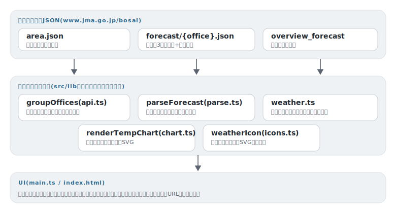

# tenki

[](https://github.com/miruky/tenki/actions/workflows/ci.yml)
[](https://github.com/miruky/tenki/actions/workflows/deploy.yml)
[](https://www.typescriptlang.org/)
[](LICENSE)

**気象庁の公開JSONをブラウザから直接読む、サーバーレスな天気ダッシュボード**

デモ: https://miruky.github.io/tenki/

## 概要

tenkiは、気象庁が公開している予報JSON(bosai/forecast)をブラウザから直接取得し、今日明日の詳細予報・週間予報・天気概況を1画面にまとめる静的Webアプリである。中間サーバーもAPIキーも持たず、GitHub Pagesに置いたHTMLとJavaScriptだけで動く。

画面は3段構成で、上段に今日・明日(発表によっては明後日まで)の天気・気温・時間帯別降水確率のカード、中段に週間予報の一覧と最高・最低気温の折れ線チャート、下段に気象庁の天気概況文を表示する。予報区は全国の地方ごとにまとめたセレクタで切り替えられ、東京都のように予報区内に細分区域(東京地方・伊豆諸島など)がある場合は第二のセレクタが現れる。選択はURLハッシュとlocalStorageに残るため、よく見る地域をブックマークできる。

天気はコード(例: 111 = 晴れ後くもり)で届くため、頻出コードの日本語ラベル表と百の位による晴・曇・雨・雪の分類を持ち、分類に応じたSVGアイコンで描く。週間の気温チャートは発表直後の初日のように欠測("")が混ざることを前提に、折れ線を連続区間ごとに分割して描画する。

### なぜ作ったのか

天気を見るだけのページは広告と過剰な装飾で重くなりがちで、気象庁のサイトは正確だが一覧性がない。気象庁の予報JSONはCORSが開いておりブラウザから直接読めるので、欲しい情報だけを静的ページに並べれば、APIキーも課金もない軽いダッシュボードが成立する。実レスポンスの構造(時系列が日付でなく系列単位で届く、気温がT00:00/T09:00の組で届く、週間初日が欠測になる)を正規化するパーサが本体で、そこは取得済みの実データをフィクスチャにしてテストしている。

## アーキテクチャ



## 技術スタック

| カテゴリ             | 技術                                            |
| :------------------- | :---------------------------------------------- |
| 言語                 | TypeScript 5(strict、実行時依存ゼロ)            |
| データ源             | 気象庁 bosai JSON(forecast / overview_forecast) |
| ビルド               | Vite 6                                          |
| テスト               | Vitest(node環境、実レスポンスのフィクスチャ)    |
| リンタ・フォーマッタ | ESLint(typescript-eslint)+ Prettier             |
| CI / 配信            | GitHub Actions / GitHub Pages                   |

## 使い方

### 予報JSONをモデルへ整形する

```ts
import { parseForecast, forecastUrl } from './lib';

const raw = await (await fetch(forecastUrl('130000'))).json();
const dashboard = parseForecast(raw); // 細分区域は parseForecast(raw, 1) のように添字で選ぶ

dashboard.days[0];
// => { date: '2026-06-13', weatherCode: '111', weatherText: '晴れ 夕方 から くもり ...',
//      pops: [{ time: '06:00', pop: 10 }, ...], tempMin: 28, tempMax: 28, wind: '北の風 ...' }
dashboard.weekly[1];
// => { date: '2026-06-14', weatherCode: '201', pop: 30, tempMin: 20, tempMax: 28, reliability: '' }
```

### 天気コードとアイコン

```ts
import { weatherCategory, weatherLabel, weatherIcon } from './lib';

weatherLabel('203'); // => くもり時々雨
weatherCategory('203'); // => rainy
weatherIcon('rainy', 32); // => <svg ...>(雲+雨粒のSVG)
```

### 気温チャート

```ts
import { renderTempChart } from './lib';

document.getElementById('chart')!.innerHTML = renderTempChart(dashboard.weekly);
```

欠測(null)が混ざっても折れ線が破綻しないことをテストで保証している。

## プロジェクト構成

- `src/lib/api.ts` エンドポイントURLと地方・予報区セレクタの構成
- `src/lib/parse.ts` forecast JSONを日付単位の表示用モデルへ正規化
- `src/lib/weather.ts` 天気コードの分類・日本語ラベル・文面整形
- `src/lib/icons.ts` 晴・曇・雨・雪のSVGアイコン
- `src/lib/chart.ts` 週間気温の折れ線SVG(欠測対応)
- `src/lib/fixture.ts` 取得済み実レスポンス(テスト入力)
- `src/main.ts` 取得・状態・描画のUI配線
- `docs/` アーキテクチャ図

## はじめ方

### 前提条件

- Node.js 22以上

### セットアップ

```bash
git clone https://github.com/miruky/tenki.git
cd tenki
npm ci
npm run dev
```

### テスト・lint・ビルド

```bash
npm test
npm run lint
npm run build
```

テストはネットワークに出ない。実レスポンスを縮約したフィクスチャを入力にパーサと描画を検証する。

### デプロイ

mainへのpushで `deploy.yml` がGitHub Pagesへ公開する。サブパス配信のためのbaseは環境変数 `TENKI_BASE` で渡す。

## 制約

- 表示は気象庁の発表をそのまま整形したもので、独自の予測はしない。
- 天気コードのラベル表は頻出コードのみで、表にないコードは晴・曇・雨・雪の分類名へ落ちる。
- 防災情報(警報・注意報)は扱わない。必要なときは気象庁のページを直接見ること。

## 設計方針

- **中間サーバーを置かない** — 気象庁のJSONはブラウザから直接読めるため、取得・整形・描画をすべてクライアントで完結させ、運用するものを増やさない。
- **パーサを本体として実データでテストする** — 予報JSONの癖(系列単位の時系列、T00:00/T09:00の気温の組、週間初日の欠測)を正規化する層に知識を集約し、取得済みの実レスポンスで検証する。
- **欠測を前提に描く** — チャートは null をまたいだ折れ線の分割、データ皆無時の空状態表示まで含めて純関数として実装する。
- **出典を明示する** — 画面のフッターで気象庁ホームページを出典として示し、防災用途には向かないことも書く。

## ライセンス

[MIT](LICENSE)
